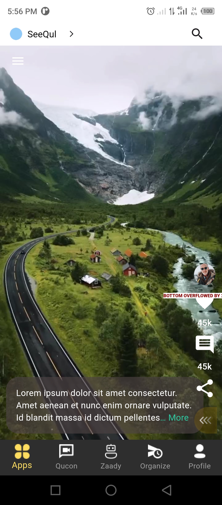
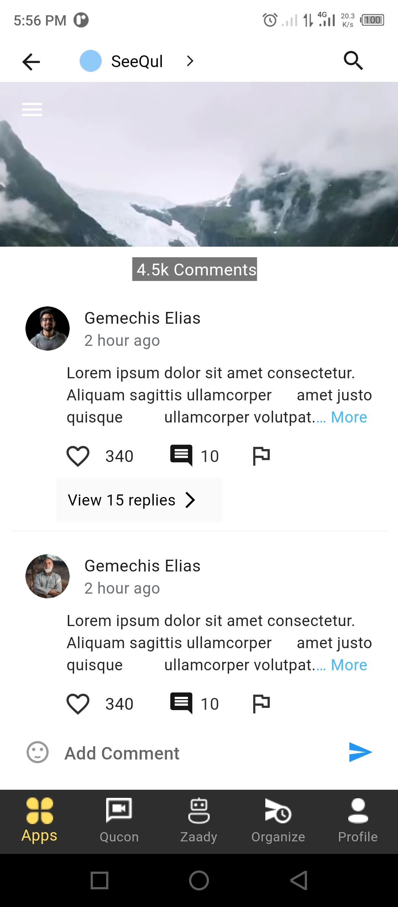
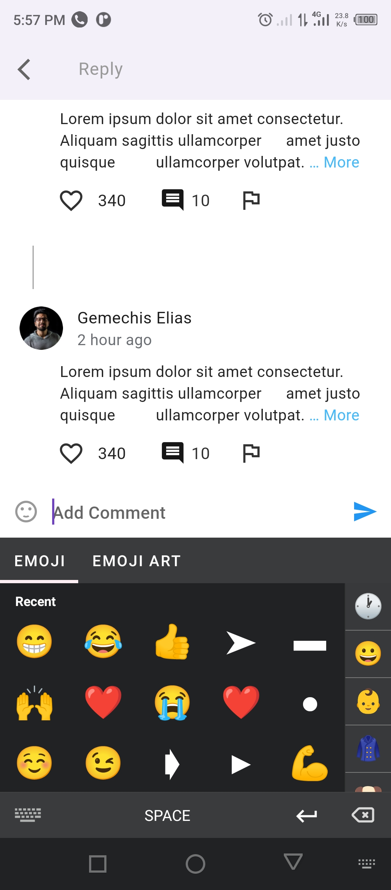
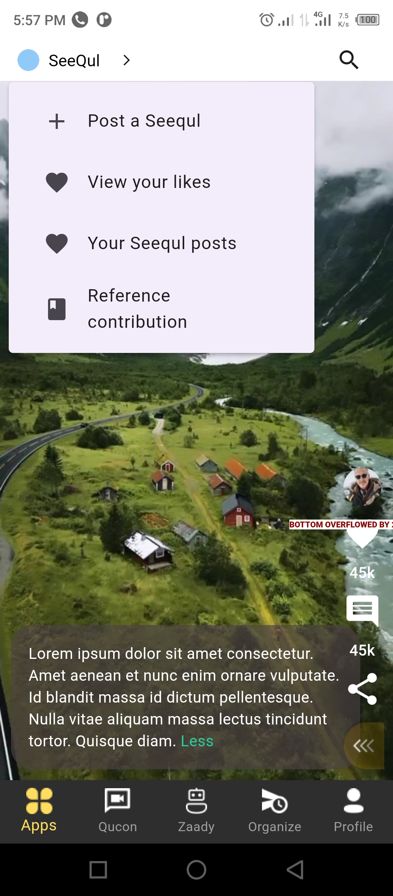

# Project Requirements 
A. Home
- Create home with the “hide/unhide” the bottom navigation menu functionality.
- Interactions on the side (chat, share, like etc)
- You should be able to show the post caption with its “view more” and “view less” functionality

B. Menu Bar

C. Comments
- View comment
- Reply comment
- Add emojis

## Screenshot Demo

  
  
  
  

Developed Using **Flutter Clean Architecture** and the following dependencies 
- chewie: ^1.7.1
- video_player: ^2.8.1
- cached_network_image: ^3.3.0
- expandable_text: ^2.3.0
- emoji_picker_flutter: ^1.6.3  

Code Written By: Gemechis Elias